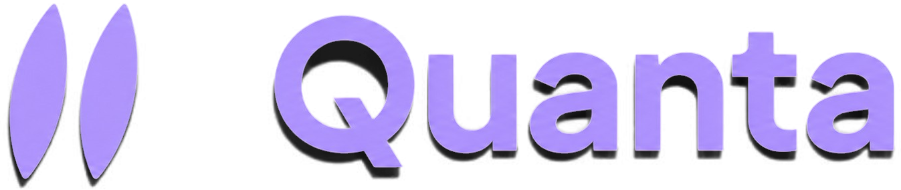
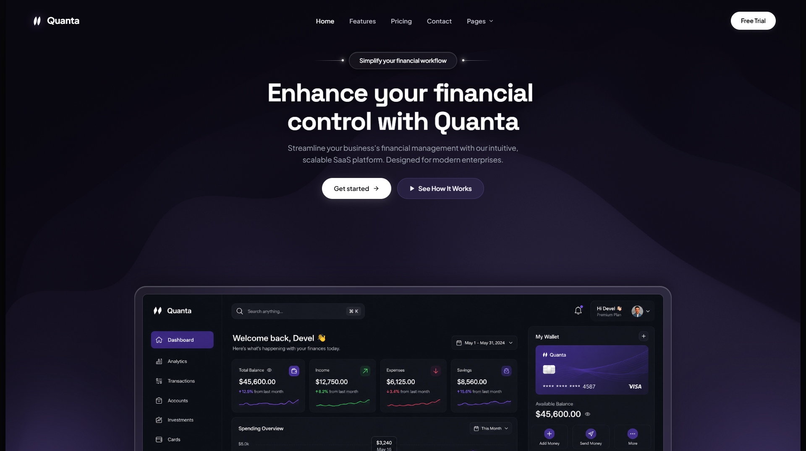

<div align="center">



<p><strong>A modern, high-performance, interactive SaaS landing page</strong></p>

Built with React 18, Vite, OGL (WebGL), Motion, and custom Canvas animations.


[Live Demo](#) · [Report Bug](../../issues) · [Request Feature](../../issues)

</div>

<br />

<div align="center">
  
</div>

<br />

## 📋 Table of Contents

- [Features](#-features)
- [Tech Stack](#️-tech-stack)
- [Getting Started](#-getting-started)
- [Scripts](#-scripts)
- [Project Structure](#-project-structure)
- [Deployment](#-deployment)
- [Roadmap](#-roadmap)
- [Contributing](#-contributing)
- [License](#-license)

---

## ✨ Features

- 🧊 **3D Glass Graphics** — Real-time WebGL glass torus with raycasting and reflection using [OGL](https://github.com/oframe/ogl).
- 🌊 **Fluid Backgrounds** — Canvas-driven interactive elastic mesh and animated gradient waves.
- ✨ **Interactive Spark FX** — Particle spark explosion effects on user clicks.
- 🔤 **Dynamic Text Effects** — Cyberpunk text decryption scramble and staggered blur-in text reveals.
- 🎴 **Glassmorphic UI** — Mouse-tracking spotlight card glow effects and custom border highlights.
- ⚡ **Lightning Fast** — Built on Vite 5 with a minimal bundle footprint.
- 📱 **Fully Responsive** — Seamless layout adaptivity across mobile, tablet, and desktop viewports.

---

## 🛠️ Tech Stack

| Category | Technology |
| :--- | :--- |
| **Framework** | [React 18](https://react.dev/) |
| **Build Tool** | [Vite 5](https://vitejs.dev/) |
| **3D & WebGL** | [OGL](https://github.com/oframe/ogl) |
| **Animations** | [Motion (Framer Motion v13)](https://motion.dev/) |
| **Icons** | [Lucide React](https://lucide.dev/) |
| **Styling** | Vanilla CSS3 (Design Tokens, Glassmorphism, CSS Grid/Flexbox) |

---

## 🚀 Getting Started

### Prerequisites

- **Node.js** v18.0.0 or higher
- **npm**, **yarn**, or **pnpm**

### Installation

1. **Clone the repository:**

   ```bash
   git clone https://github.com/your-username/quanta-saas-landing.git
   cd quanta-saas-landing
   ```

2. **Install dependencies:**

   ```bash
   npm install
   ```

3. **Start the development server:**

   ```bash
   npm run dev
   ```

4. Open your browser and navigate to `http://localhost:5173`.

---

## 📦 Scripts

| Command | Description |
| :--- | :--- |
| `npm run dev` | Starts the local development server on port `5173` with HMR. |
| `npm run build` | Bundles production-ready assets into the `dist/` folder. |
| `npm run preview` | Previews the production build locally. |

---

## 📂 Project Structure

```text
├── assets/             # Static brand & media assets
├── public/             # Public static assets (logy.png, previewww.png)
├── src/
│   ├── components/     # Interactive components & WebGL scripts
│   │   ├── GlassTorus3D.jsx   # 3D WebGL Torus (OGL)
│   │   ├── ElasticMesh.jsx    # Canvas interactive elastic grid
│   │   ├── GradientWaves.jsx  # Fluid background waves canvas
│   │   ├── DecryptedText.jsx  # Matrix scramble text component
│   │   ├── BlurText.jsx       # Motion blur-in text reveal
│   │   ├── SpotlightCard.jsx  # Mouse-tracking glowing card
│   │   ├── BorderGlow.jsx     # Gradient glowing border panel
│   │   ├── ClickSpark.jsx     # Click particle sparks
│   │   └── CountUp.jsx        # Scroll counter component
│   ├── App.jsx          # Main landing page layout
│   ├── main.jsx         # Application entry point
│   └── index.css        # Core CSS design system & tokens
├── index.html            # HTML entry point
├── package.json          # Project dependencies and scripts
└── vite.config.js        # Vite configuration file
```

---

## 🌐 Deployment

### Deploy to GitHub Pages

1. In `vite.config.js`, set `base: '/<repository-name>/'`.
2. Build the project:
   ```bash
   npm run build
   ```
3. Deploy the `dist` folder using `gh-pages` or a GitHub Actions workflow.

### Deploy to Vercel

1. Push your code to GitHub.
2. Import your repository into [Vercel](https://vercel.com).
3. Vercel auto-detects Vite — click **Deploy**.

---

## 🗺️ Roadmap

- [ ] Add dark/light theme toggle
- [ ] Add pricing section with animated toggle
- [ ] Add i18n support
- [ ] Improve Lighthouse performance score

See the [open issues](../../issues) for a full list of proposed features and known issues.

---

## 🤝 Contributing

Contributions make the open-source community amazing. Any contributions are **greatly appreciated**.

1. Fork the project
2. Create your feature branch (`git checkout -b feature/AmazingFeature`)
3. Commit your changes (`git commit -m 'Add some AmazingFeature'`)
4. Push to the branch (`git push origin feature/AmazingFeature`)
5. Open a Pull Request

---

## 📄 License

Distributed under the MIT License. See [`LICENSE`](LICENSE) for more information.

<div align="center">

Made with ⚡ and too much coffee

</div>
